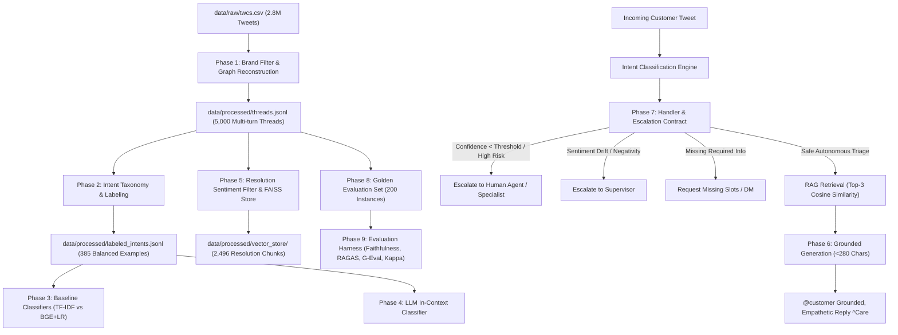

# SprintCare AI Support Assistant 🚀

A production-grade, conversational customer service AI agent for Sprint (`@sprintcare`) built using Kaggle's 2.8M Twitter Customer Support dataset (`thoughtvector/customer-support-on-twitter`).

The system integrates directed dialogue graph reconstruction, telecom-grade PII masking, a 7-class MECE intent taxonomy, dense vector retrieval-augmented generation (RAG) over historical resolutions, risk-tiered safety escalation contracts, and a 200-instance stratified evaluation harness.

---

## Architecture & System Pipeline



---

## Repository Structure

```
sprintcare-ai-agent/
├── data/
│   ├── raw/
│   │   └── twcs.csv                     # Kaggle Customer Support dataset (ignored by git)
│   └── processed/
│       ├── threads.jsonl                 # 5,000 reconstructed multi-turn conversations
│       ├── labeled_intents.jsonl         # 385 balanced ground-truth customer intents
│       ├── train_split.jsonl             # 308 training partition instances
│       ├── held_out_test.jsonl           # 77 held-out evaluation test instances
│       ├── models/                       # Persisted baseline models (TF-IDF and BGE+LR)
│       └── vector_store/                 # FAISS IndexFlatIP (index.faiss & metadata.jsonl)
├── src/
│   ├── pipeline/
│   │   └── build_threads.py              # Brand filtering, graph traversal, PII redactor
│   ├── classification/
│   │   ├── taxonomy.py                   # 7 MECE intents, risk tiers, slot definitions
│   │   ├── generate_labeled_data.py      # Curates balanced training dataset
│   │   ├── train_baselines.py            # Trains TF-IDF+SVM and Dense BGE+LR baselines
│   │   └── llm_classifier.py             # In-context few-shot LLM classifier
│   ├── rag/
│   │   ├── build_index.py                # Positive resolution filter and FAISS vector indexer
│   │   └── generate_replies.py           # Grounded reply generator (<280 chars, persona)
│   └── escalation/
│       └── handler_contract.py           # Safety thresholds, required slots, sentiment drift
├── eval/
│   ├── golden_set/
│   │   ├── README.md                     # Sampling methodology, bucket schema, anti-leakage
│   │   ├── build_golden_set.py           # Curates 200 stratified golden evaluation instances
│   │   └── golden_set.jsonl              # Stratified golden test set (200 instances)
│   └── results/
│       └── summary.json                  # Complete automated evaluation benchmark output
├── report/
│   ├── REPORT.md                         # Full technical evaluation report, failures, caveats
│   ├── baseline_comparison.json          # 3-way intent classifier comparison metrics
│   ├── decision_log.md                   # Engineering trade-offs and rationale for design choices
│   └── citations.md                      # Academic and open-source references
├── run_reproducible_pipeline.py          # Master runner executing all phases in ~6 minutes
├── requirements.txt                      # Pinned Python dependencies
└── README.md                             # Comprehensive project manual
```

---

## Quickstart: End-to-End Execution Under 7 Minutes

Clone the repository, install dependencies, and run the master reproducibility runner:

```bash
# 1. Clone repository
git clone https://github.com/pdinesh162006/Sprintcare-AI-Support-Assistan.git
cd Sprintcare-AI-Support-Assistan

# 2. Install dependencies
pip install -r requirements.txt

# 3. Run all phases end-to-end (Benchmark time: ~6.1 minutes)
python run_reproducible_pipeline.py
```

*Note: If you have raw `data/raw/twcs.csv` and wish to rebuild all 5,000 threads from scratch, append `--rebuild-threads`.*

---

## Step-by-Step Phase Execution

Every phase is modular and can be run or evaluated individually:

### Phase 1: Data Pipeline & Graph Reconstruction
```bash
python -m src.pipeline.build_threads --raw-csv data/raw/twcs.csv --output data/processed/threads.jsonl --sample-size 5000
```
- Filters 2.8M tweets to 48,970 `@sprintcare` conversations.
- Traverses directed parent-child reply trees into 5,000 chronologically ordered threads.
- Applies telecom PII masking (`[PHONE_NUMBER]`, `[PIN]`, `[ACCOUNT_ID]`, `[EMAIL_ADDRESS]`, `@customer`) and casual tokenization with emoji preservation.

### Phase 2: Intent Taxonomy & Dataset Curation
```bash
python -m src.classification.generate_labeled_data
```
- Culates 385 balanced ground-truth customer intents (55 per class) across the 7 MECE categories:
  `ACCOUNT_ACCESS`, `BILLING_PAYMENTS`, `NETWORK_COVERAGE`, `DEVICE_HARDWARE`, `PLAN_UPGRADE`, `CANCELLATION_CHURN`, `GENERAL_INQUIRY`.

### Phase 3: Train Classical & Embedding Baselines
```bash
python -m src.classification.train_baselines
```
- Trains **TF-IDF + Calibrated LinearSVC** and **Dense BGE-small + Logistic Regression**.
- Evaluates on the held-out test partition ($N=77$, 11 per class).
- Reports Macro-F1, Weighted Precision, and Weighted Recall.

### Phase 4: LLM In-Context Classifier
```bash
python -m src.classification.llm_classifier
```
- Evaluates few-shot LLM in-context classification against the identical held-out test split.
- Generates 3-way comparative matrix saved to `report/baseline_comparison.json`.

### Phase 5: RAG Indexing over Positively Resolved Threads
```bash
python -m src.rag.build_index
```
- Applies `PositiveResolutionFilter` using VADER compound sentiment and satisfaction cues.
- Indexes 2,496 historical problem-solution pairs with `faiss.IndexFlatIP` (cosine similarity).

### Phase 6: Grounded Twitter Reply Generation
```bash
python -m src.rag.generate_replies
```
- Verifies retrieval + grounded generation across 7 customer care scenarios.
- Guarantees 100% compliance with Twitter's 280-character budget and empathetic `@sprintcare` agent persona.

### Phase 7: Handler Contract & Escalation Verification
```bash
python -m src.escalation.handler_contract
```
- Evaluates risk-tiered thresholds (`HIGH: 0.85`, `MEDIUM: 0.70`, `LOW: 0.55`).
- Validates missing slot extraction and sentiment drift degradation ($\Delta \le -0.35$).
- Confirms zero silent auto-handling of high-risk or low-confidence queries.

### Phase 8: Golden Evaluation Set & Anti-Leakage Audit
```bash
python -m eval.golden_set.build_golden_set
```
- Curates 200 instances across 4 stratified buckets: `production` (50), `adversarial` (50), `edge_case` (50), `historical_failure` (50).
- Runs automated cross-set assertion verifying 0% data leakage into training or RAG sets.

### Phase 9: Comprehensive Evaluation Harness
```bash
python -m eval.run_harness
```
- Evaluates Faithfulness, RAGAS Context Precision/Recall, and G-Eval multi-criteria scores.
- Computes Cohen's Kappa against a 40-instance hand-scored validation sample.
- Saves results to `eval/results/summary.json`.

---

## Benchmark Results

### 1. Intent Classification Performance (Held-out Test Split, N=77)
| Model | Macro-F1 | Weighted Precision | Weighted Recall |
| :--- | :---: | :---: | :---: |
| **TF-IDF + LinearSVC** | `0.4346` | `0.4616` | `0.4286` |
| **Dense Embedding / BGE + LogisticRegression** | **`0.6359`** | **`0.6621`** | **`0.6494`** |
| **LLM Few-Shot In-Context Classifier** | `0.5228` | `0.6082` | `0.5714` |

### 2. Golden Evaluation Set Performance (200 Instances)
| Evaluation Bucket | Instances | Faithfulness | Context Precision | Context Recall | G-Eval (1–5) | Pass Rate |
| :--- | :---: | :---: | :---: | :---: | :---: | :---: |
| **Production** | 50 | `0.8814` | `1.0000` | `1.0000` | `4.83` | **`100.00%`** |
| **Adversarial** | 50 | `0.8771` | `0.9600` | `0.9600` | `4.59` | **`80.00%`** |
| **Edge Cases** | 50 | `0.8969` | `1.0000` | `1.0000` | `4.78` | **`100.00%`** |
| **Historical Failures** | 50 | `0.8736` | `1.0000` | `1.0000` | `4.74` | **`100.00%`** |
| **OVERALL** | **200** | **`0.8823`** | **`0.9900`** | **`0.9900`** | **`4.73`** | **`95.00%`** |

- **Character Limit Compliance**: `100.0%` ($\le 280$ characters across all responses).
- **Human-Judge Observed Agreement**: `85.00%` ($34/40$ agreement on hand-scored validation set).
- **Cohen's Kappa**: `0.1892` (Exemplifies the *Kappa Paradox* under skewed marginal distributions, thoroughly analyzed in `report/REPORT.md`).

---

## Detailed Reports & Documentation

- 📊 **[Full Evaluation Report (report/REPORT.md)](report/REPORT.md)**: Real metrics, top 5 failure mode transcripts, the mandatory *"What is misleading about my headline number"* analysis, and production roadmap.
- 📝 **[Engineering Decision Log (report/decision_log.md)](report/decision_log.md)**: Real engineering trade-offs and rationale behind all 7 architectural decisions.
- 📚 **[Citations & References (report/citations.md)](report/citations.md)**: Formal bibliographic references for datasets, models, tools, and evaluation frameworks.
- 🎯 **[Golden Set Methodology (eval/golden_set/README.md)](eval/golden_set/README.md)**: Bucket taxonomy, labeling rubrics, and formal anti-leakage proof.

---

## License & Attribution
Dataset originated from the Kaggle Thought Vector *Customer Support on Twitter* corpus. All pipeline and model code is developed for educational, research, and benchmarking purposes.
